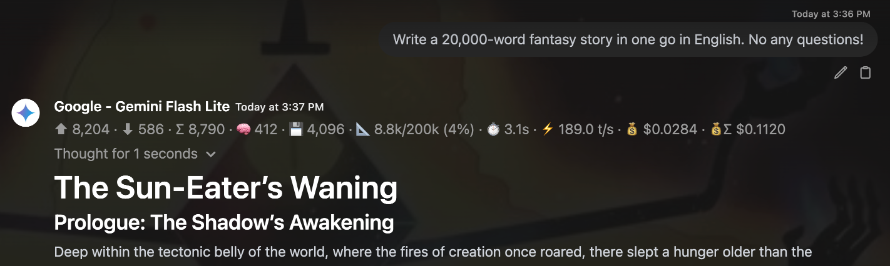

# Token Usage & Cost Display

[](https://github.com/SmetDenis/openwebui-token-usage-display/actions/workflows/ci.yml)
[](https://openwebui.com)
[](LICENSE)

A filter plugin for [Open WebUI](https://openwebui.com) that shows detailed token, context, timing and cost statistics below each AI response - token counts (input/output/total, running chat total, reasoning, cached, audio), context-window utilization, generation time, tokens/second and message/chat cost.

Recommended in the official Open WebUI documentation - see the
[Community Plugins catalog](https://docs.openwebui.com/features/extensibility/community/). Install it from the [community store post](https://openwebui.com/posts/token_usage_display_a94ea72f) or straight from this repo.



```text
⬆︎ 8,204 · ⬇︎ 586 · Σ 8,790 · 🧮 31,460 · 🧠 412 · 💾 4,096 · 📐 8.8k/200k (4%) · ⏱ 3.1s · ⚡ 189.0 t/s · 💰 $0.0284 · 💰Σ $0.1120
```

Each metric only appears when it has a value, so the line stays clean for models that don't report detailed breakdowns.

## Installation

1. In Open WebUI, open **Admin Panel → Functions** (or **Workspace → Functions**).
2. Click **+** to add a new function.
3. Copy the entire contents of [`usage_display.py`](usage_display.py) and paste it in.
4. Save, then enable the filter for the models you want it on.

No `pip install`, no dependencies to add. `tiktoken` is **optional** - it's only used to *estimate*
tokens when a provider reports no usage; the plugin loads fine without it.

> **Works on Open WebUI 0.9.0+.** It's built for the 0.10.x data model (structured output +
> normalized usage) but degrades gracefully on 0.9.x - the only limitation there is provider-reported
> cost in `auto` mode, which needs 0.10.0+ (use `estimate` on older versions).

## What it displays

- **Input / output / total** token counts
- **Running chat token total** (`🧮`) - the sum of every response's `Σ` in the chat, the token twin of `💰Σ`
  (handy for local/free models with no cost). The model re-reads the history each turn, so it counts
  *processed* tokens and grows much faster than the context window
- **Reasoning / thinking** tokens - OpenAI o3/o4-mini & GPT-5, Gemini thinking, DeepSeek R1, Claude thinking, etc. (read from both the Chat Completions and the newer Responses API shapes)
- **Cached prompt** tokens - OpenAI prompt cache and Anthropic `cache_read` / `cache_creation`
  (Anthropic cache is correctly counted as *additional* to input)
- **Context-window utilization** - how much of the model's window you've used, e.g. `8.8k/200k (4%)`; the icon turns 🟠 at 30% and 🔴 at 70% by default (configurable)
- **Generation time** and **tokens/second**
- **Cost** - the provider's own reported cost when available (OpenRouter, LiteLLM, ...), or an optional estimate from [models.dev](https://models.dev) prices (always marked `≈`); shown per message (`💰`)
  and as a running chat total (`💰Σ`)
- **Audio** tokens (off by default) and the **base model name** for workspace models

## How it works

The filter reads Open WebUI's **normalized usage** attached to the response, so it works consistently across providers and response types:

- **Providers:** OpenAI (Chat Completions **and** Responses API), Anthropic, Google Gemini, Ollama, llama.cpp, and any OpenAI-compatible endpoint.
- **Token counts** come straight from the reported usage. When a provider reports no usage, the plugin falls back to **tiktoken** estimation over the response text.
- **Timing / tokens-per-second** prefer the provider's own numbers where available (Ollama
  `eval_duration`, llama.cpp `timings`). Otherwise a wall-clock measurement is shown, prefixed with `~`
  to indicate it's approximate.

## Context-window detection

The context window size is resolved in this order:

1. **Manual override** valve (if set)
2. **`num_ctx`** captured from the request (Ollama / local models)
3. **Your `context_size_map`** - an explicit user override, so it wins over the automatic sources below
4. **What the serving backend reports for the model** - automatic, no network: llama.cpp (builds since May 2026) and llama-swap (with `capabilities.context` set) list the running window as `meta.n_ctx` in `/v1/models`, vLLM as `max_model_len`, and Open WebUI hands that listing to the plugin. This is your server's real `--ctx-size`, not the model's trained maximum
5. **llama.cpp / llama-swap probe** - optional, opt-in; asks llama.cpp `/v1/models` (then `/props` on older builds) or llama-swap `/running`, and wins over the tables only when the row matches the called model's id
6. **Live models.dev lookup** - optional, opt-in; fetches current sizes and caches them (default off)
7. **Built-in table** - seeded from [models.dev](https://models.dev), covering the popular OpenAI / Anthropic / Gemini / Llama / DeepSeek / Grok / Mistral / Qwen / Kimi / GLM / MiniMax / Cohere families
8. **A probed backend's only running model, when its id differs from the called one** (an alias) - last, because with a cloud model called it would be another model's window

**Workspace models resolve via their base model.** For a custom model / "agent" built on a base model, matching (context size **and** cost) uses the model's **`base_model_id`** - the real underlying LLM - not your custom model id. So a single `context_size_map` entry keyed on the base model covers every agent built on it.

## Cost

Cost has three modes, set by the **`cost_mode`** valve:

1. **`auto`** (default) - show cost **only when your provider or proxy reports it** in the usage payload
   (e.g. OpenRouter's `usage.cost`, a LiteLLM proxy). Nothing is fetched or estimated - this is always the real, billed number.
2. **`estimate`** - additionally *approximate* the cost from models.dev prices whenever the provider reports none. Estimates are always marked `≈`.
3. **`off`** - never show, compute or fetch anything cost-related.

In `estimate` mode the price is resolved as: your manual **`price_map`** valve → live models.dev
`api.json` (per-provider prices, cached ~24h) → a built-in offline price table. Cached and reasoning tokens are priced correctly.

> **Estimates are approximate on purpose.** models.dev lists *published* per-provider prices; your real
> bill can differ, sometimes by a large multiple (gateways route the same model id to different upstream
> providers at different prices, apply cache/tier/long-context adjustments a static table can't see).
> When you need the exact figure, use a provider/proxy that reports `cost` in usage - `auto` mode is then
> the **authoritative billed number**.

### Does the cost include tool / function / MCP calls?

**Yes - for the tools Open WebUI runs itself.** A tool / function / MCP call is just extra tokens across several LLM round-trips, and Open WebUI **sums the reported `cost` across every round** of a multi-round tool turn. What no client-side display can capture is a surcharge the provider charges *on top of* tokens and does **not** put into `usage.cost` - e.g. a gateway's own server-side web search, or a BYOK engine billed outside the generation. Turn on `debug_mode` to see a `web_search` hint and the provider's
`cost_details` split.

## Configuration

- Every metric can be toggled on/off via admin **Valves**; users can disable the whole display via
  **UserValves**.
- **Metric order** is configurable via the admin `display_order` valve (comma-separated keys).
- **Line appearance** is configurable: `separator`, `icon_style` (`emoji` / `simple` monochrome / `off`
  bare values), and `compact_numbers` (abbreviate token counters as `k`/`M`).
- Context detection: manual size override, a custom `{"model-substring": tokens}` map, the live models.dev fetch toggle, and optional llama.cpp / llama-swap URLs (the size a backend advertises is read automatically).
- Cost: `cost_mode`, a running chat-total toggle, a `cost_min_display` threshold, a manual `price_map`, and the live models.dev price-fetch toggle.

## Troubleshooting

Turn on the **`debug_mode`** valve and open the **"Token Usage & Cost Display - Debug info"** source under the message (also mirrored to the server log). Its `cost_debug`, `context_debug`, `model` and
`valves` blocks name the exact broken link.

- **Nothing shows below the response, but `debug_mode` prints a full payload with correct tokens to the server log.** The plugin ran fine - Open WebUI is hiding the line. Its frontend renders the status line only when the model's **Status Updates** capability is on, and the debug panel only when
  **Citations** is on (Workspace → Models → *your model* → Capabilities). This hits workspace/"agent"
  models, which store an explicit capability set; plain connection models default to on.
- **Nothing shows below the response (no tokens).** The provider returned no `usage`. In streaming, most OpenAI-compatible endpoints only send a usage chunk when asked - enable the model's **Usage** capability
  (Workspace → Models → *your model* → Capabilities → **Usage**). Behind LiteLLM, set
  `general_settings: { always_include_stream_usage: true }`.
- **Tokens show but cost is blank in `auto` mode.** In `auto`, cost appears only when the provider/proxy reports it **inside the response body** `usage`. A LiteLLM proxy returns cost in the
  `x-litellm-response-cost` HTTP header by default, which Open WebUI does not read - move it into the body with `litellm_settings: { include_cost_in_streaming_usage: true }`, or switch to `cost_mode: estimate`.
- **Context shows the model's maximum (e.g. `131.1k` for Qwen3), not your llama.cpp `--ctx-size`.** `context_debug.source` is `static_table` or `modelsdev`: the backend did not advertise its window. Update llama.cpp (the `meta.n_ctx` field in `/v1/models` appeared in May 2026) and refresh Open WebUI's model list, set `capabilities.context` in llama-swap, set the `llamacpp_url` / `llama_swap_url` valve, or add a `context_size_map` entry. `model.backend_context` in the debug payload shows the running (`n_ctx`) and trained (`n_ctx_train`) windows the listing carries.
- **`estimate` cost is blank / context % missing.** The model id matched no price/context entry (common when Open WebUI exposes a display name like `Anthropic - Opus`). Add a `price_map` / `context_size_map`
  keyed to a substring of the id, or use a canonical id. For a workspace model, key the map on the
  **base** model.

## Notes & limitations

- For providers that don't report a generation duration (OpenAI, Anthropic), time and t/s are wall-clock, marked `~`; local providers (Ollama, llama.cpp) report real generation time.
- The chat totals (`🧮`, `💰Σ`) are summed from each past response's stored usage. Temporary chats (and API
  requests without a chat id) don't pass that history usage to filters, so there both totals equal the
  current message and are hidden.
- In multi-round tool turns, Open WebUI only carries the last round's provider-specific cache/timing fields, so those can reflect the final round rather than the whole turn.
- Estimated cost (`≈`) is a ballpark from published models.dev prices, not your invoice. Provider-reported cost (`auto` mode) is exact.

## Links

- Open WebUI community post: <https://openwebui.com/posts/token_usage_display_a94ea72f>
- Official Open WebUI docs - Community Plugins catalog:
  <https://docs.openwebui.com/features/extensibility/community/>
- Full changelog: [CHANGELOG.md](CHANGELOG.md)

## Contributing

See [CONTRIBUTING.md](CONTRIBUTING.md). In short: install [uv](https://docs.astral.sh/uv/), run
`make install-dev`, then `make pre-commit` (ruff + mypy strict + pytest, coverage ≥ 95%).

## License

[MIT](LICENSE)
